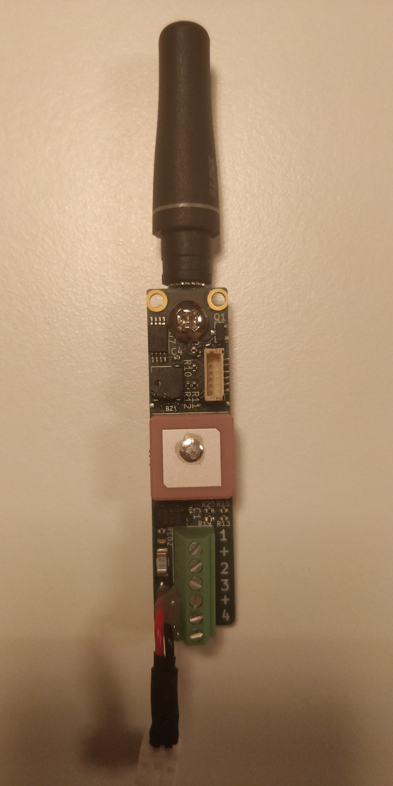
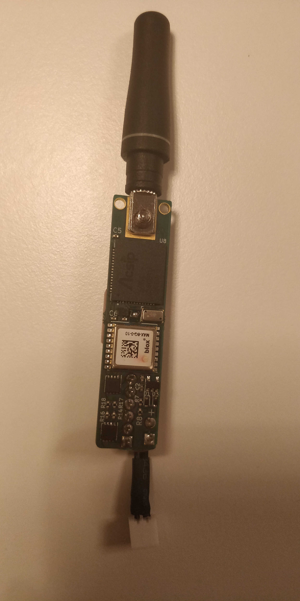

# Flite Controller
## the world smallest (maybe) all in one flight controller

### Features
1. Accelerometer
1. Barometer
1. 4x pyro channels
1. GPS
1. Long-ange telemetry
1. Built-in antennas
1. low power processor
1. high frequency onboard storage of data
1. best of all, it fits in a 17mm body tube

### technical details
The whole board is built around the AcSIP S76S. It is a "System On A Chip" containing a LoRa modem and a STM32L073xZ.

The telemetry antenna is connected to the board using friction and a screw while the GPS uses an onboard patch antenna. Due to the small size the RF-section is very poorly designed but the GPS line has an amplifier and a filter at the very least. The telemetry range is probably around 15km but at the very least 10km.

It has an expansion port with 3V3, UART, BOOT0 and and IO pin for programming and connecting accessories. Two SWD pads are also exposed but unused at the moment.

The 200g accelerometer used is the ADXL343 but in hindsight I should have put a bmi088 or bmx160 since no rocket will ever reach 200g (I was fucked by the chip shortage as well). MS5607-02BA is the pressure sensor but they are pretty much all the same. The current GPS module is the ublox m8 but anything with MAX form-factor will work.

It's a 4 layer PCB with a SIG/SIG/GND/SIG stackup. Designed for production with Aisler but they are usually slow and expensive. European though so they don't have suicide nets or shit out a bunch of toxins which is a plus!